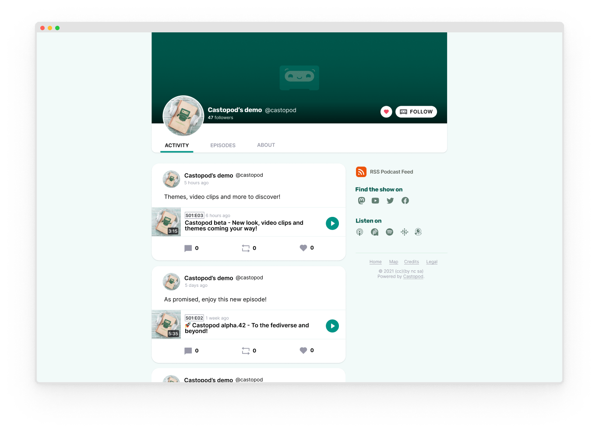

<!--
N.B.: This README was automatically generated by https://github.com/YunoHost/apps/tree/master/tools/README-generator
It shall NOT be edited by hand.
-->

# Castopod for YunoHost

[](https://dash.yunohost.org/appci/app/castopod)    
[](https://install-app.yunohost.org/?app=castopod)

*[Lire ce readme en français.](./README_fr.md)*

> *This package allows you to install Castopod quickly and simply on a YunoHost server.
If you don't have YunoHost, please consult [the guide](https://yunohost.org/#/install) to learn how to install it.*

## Overview

Castopod is a free & open-source hosting platform made for podcasters who want engage and interact with their audience.

Castopod is easy to install and was built on top of CodeIgniter4, a powerful PHP framework with a very small footprint.

### Status

Castopod is currently in beta but already quite stable and used by podcasters around the world!


### Features

- Free & open-source (AGPL v3 License)
- Focused on data sovereignty: your content, audience, and analytics belong to you, and you only
- Podcasting 2.0 features: GUID, locked, transcripts, funding, chapters, location, persons, soundbites, …
- Built-in social network
- Built-in analytics
- Built-in marketing tools
- Monetization
- Publish your episodes everywhere with RSS:
- Podcast import: move your existing podcast into Castopod
- Move your podcast out of Castopod
- Multi-tenant: host as many podcasts as you want
- Multi-user: add contributors and set roles
- i18n support: translated in English, French & Polish with more to come!

**Shipped version:** 1.0.1~ynh1

**Demo:** https://podcast.podlibre.org/@podlibre_fr

## Screenshots



## Disclaimers / important information

## Configuration

 * How to configure this app: Go to `domain.ltd/cp-admin` to connect to the administration panel.

#### Multi-user support

 * Are LDAP and HTTP auth supported? **No**
 * Can the app be used by multiple users? **Yes**

## Limitations

* :warning: Installation possible only on a root domain or subdomain.

## Documentation and resources

* Official app website: <https://castopod.org/>
* Official admin documentation: <https://docs.castopod.org/>
* Upstream app code repository: <https://code.castopod.org/adaures/castopod>
* YunoHost documentation for this app: <https://yunohost.org/app_castopod>
* Report a bug: <https://github.com/YunoHost-Apps/castopod_ynh/issues>

## Developer info

Please send your pull request to the [testing branch](https://github.com/YunoHost-Apps/castopod_ynh/tree/testing).

To try the testing branch, please proceed like that.

``` bash
sudo yunohost app install https://github.com/YunoHost-Apps/castopod_ynh/tree/testing --debug
or
sudo yunohost app upgrade castopod -u https://github.com/YunoHost-Apps/castopod_ynh/tree/testing --debug
```

**More info regarding app packaging:** <https://yunohost.org/packaging_apps>
