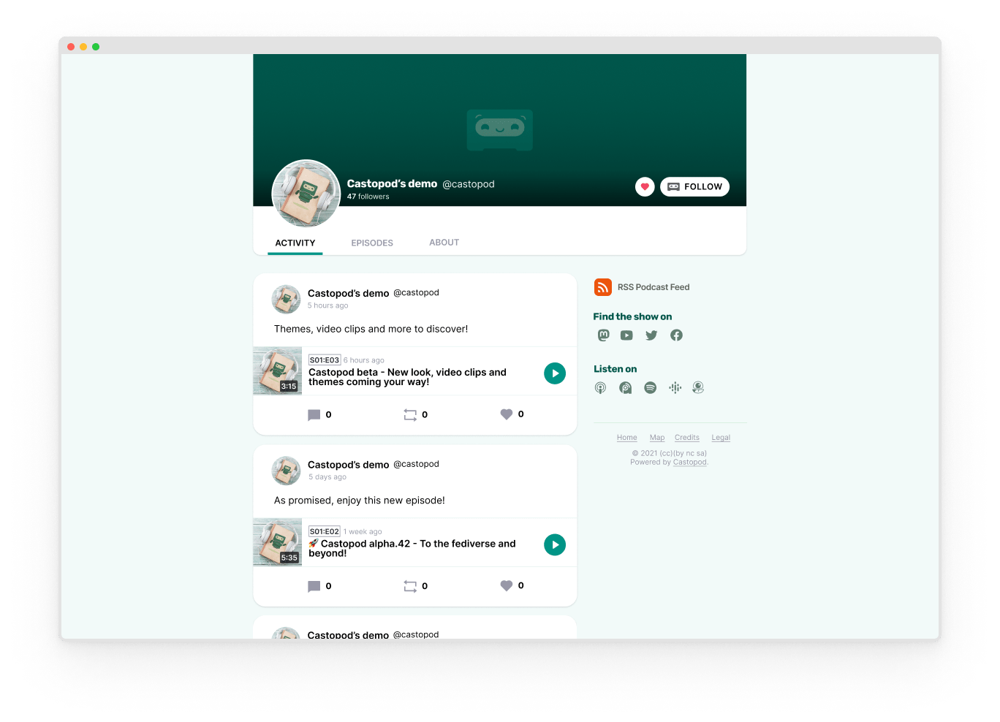

<!--
NB: Deze README is automatisch gegenereerd door <https://github.com/YunoHost/apps/tree/master/tools/readme_generator>
Hij mag NIET handmatig aangepast worden.
-->

# Castopod voor Yunohost

[](https://ci-apps.yunohost.org/ci/apps/castopod/)


[](https://install-app.yunohost.org/?app=castopod)

*[Deze README in een andere taal lezen.](./ALL_README.md)*

> *Met dit pakket kun je Castopod snel en eenvoudig op een YunoHost-server installeren.*  
> *Als je nog geen YunoHost hebt, lees dan [de installatiehandleiding](https://yunohost.org/install), om te zien hoe je 'm installeert.*

## Overzicht

Castopod is a free & open-source hosting platform made for podcasters who want engage and interact with their audience.
Castopod is easy to install and was built on top of CodeIgniter4, a powerful PHP framework with a very small footprint.


### Features

- Focused on data sovereignty: your content, audience, and analytics belong to you, and you only
- Podcasting 2.0 features: GUID, locked, transcripts, funding, chapters, location, persons, soundbites…
- Built-in social network, analytics, marketing tools
- Monetization
- Publish your episodes everywhere with RSS:
- Podcast import: move your existing podcast into Castopod
- Move your podcast out of Castopod
- Multi-tenant: host as many podcasts as you want
- Multi-user: add contributors and set roles

**Geleverde versie:** 1.13.3~ynh1

**Demo:** <https://podcast.podlibre.org/@podlibre_fr>

## Schermafdrukken



## Documentatie en bronnen

- Officiele website van de app: <https://castopod.org/>
- Officiele beheerdersdocumentatie: <https://docs.castopod.org/>
- Upstream app codedepot: <https://code.castopod.org/adaures/castopod>
- YunoHost-store: <https://apps.yunohost.org/app/castopod>
- Meld een bug: <https://github.com/YunoHost-Apps/castopod_ynh/issues>

## Ontwikkelaarsinformatie

Stuur je pull request alsjeblieft naar de [`testing`-branch](https://github.com/YunoHost-Apps/castopod_ynh/tree/testing).

Om de `testing`-branch uit te proberen, ga als volgt te werk:

```bash
sudo yunohost app install https://github.com/YunoHost-Apps/castopod_ynh/tree/testing --debug
of
sudo yunohost app upgrade castopod -u https://github.com/YunoHost-Apps/castopod_ynh/tree/testing --debug
```

**Verdere informatie over app-packaging:** <https://yunohost.org/packaging_apps>
